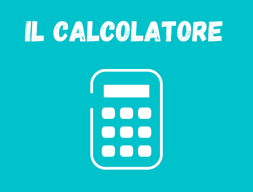
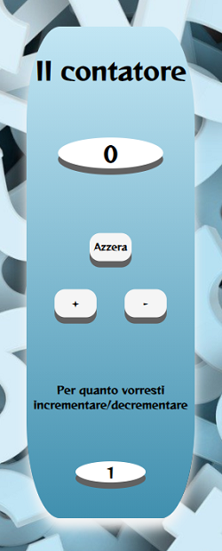

<details open="open">
  <summary>Contenuti</summary>
  <ol>
    <li><a href="#descrizione">Descrizione</a></li>
    <li><a href="#come-funziona">Come funziona</a></li>
    <li><a href="#css">CSS</a></li>
    <li><a href="#codice-javascript">Codice Javascript</a></li>
    <li><a href="#contatti">Contatti</a></li>
  </ol>
</details>

## Descrizione
Contatore che permette di incrementare o decrementare un numero visualizzato in un display, per uno, o per un numero a scelta dell'utente.


## Come funziona
Gli elementi con cui possiamo intergire sono:
* Il pulsante azzera
* Il pulsante incrementa (+)
* Il pulsante decrementa (-)
* Un input numero, con cui verrà incrementata o decrementata la cifra del display

## CSS
Il codice CSS è stato impostato per rendere la pagina completamente responsive con l'utilizzo delle apposite media queries. A seguire l'esempio responsive per smartphone:



## Codice Javascript
Il display e i pulsanti sono stati implementati con javascript:


```javascript
let divCont = document.getElementById("display-contatore");
let divAzzera = document.getElementById("button-azzera");
let divButtons = document.getElementById("buttons-inc");

/* Implementazioni contatore e bottoni */
let contatore = document.createElement("p");               
contatore.innerText = "0";             
divCont.appendChild(contatore); 

let buttonAzzera = document.createElement("button");
buttonAzzera.innerHTML = "Azzera";
buttonAzzera.setAttribute("data-action","azzera"); 
divAzzera.appendChild(buttonAzzera);
        
let button = document.createElement("button");
button.innerHTML = "+";
button.setAttribute("data-action","incremento"); 
divButtons.appendChild(button); 

let button2 = document.createElement("button");
button2.innerHTML = "-"; 
button2.setAttribute("data-action","decremento"); 
divButtons.appendChild(button2); 
```


Anzichè assegnare un gestore separato a ciascun pulsante, ho preferito utilizzare la delega degli eventi, assegnandone uno unico, con i rispettivi metodi da chiamare.
Nell'immagine sotto, possiamo notare l'implementazione della classe pulsanti, il proprio costruttore, e gli eventi dei singoli pulsanti.


```javascript
class Pulsanti {
    constructor(elem) {
      this._elem = elem;
      elem.onclick = this.onClick.bind(this); // (*)
    }

    /* Evento bottone azzera */
    azzera() {
        let cont = document.getElementsByTagName("p")[0].innerHTML;
        cont = Number(cont);
        cont = 0;
        cont = cont.toString();
        document.getElementsByTagName("p")[0].innerHTML = cont; 
    }

    /* Evento bottone incremento */
    incremento() {
        let cont = document.getElementsByTagName("p")[0].innerHTML;
        cont = Number(cont);
        let num = document.getElementById("incremento").value;
        num = Number(num);  
        if (num <= 0) {
            alert("Non posso incrementare per 0 o per valore negativo");
        } else {
            cont += num;
        }
        cont = cont.toString();
        if (cont.length > 9) {
            alert("Il contatore è arrivato al limite!");
        } else {
            document.getElementsByTagName("p")[0].innerHTML = cont; 
        }
    }

    /* Evento bottone decremento */
    decremento() {
        let cont = document.getElementsByTagName("p")[0].innerHTML;
        cont = Number(cont);
        let num = document.getElementById("incremento").value;
        num = Number(num);  
        if (num <= 0) {
            alert("Non posso decrementare per 0 o per valore negativo");
        } else {
            cont -= num;
        }
        cont = cont.toString();
        if (cont.length > 9) {
            alert("Il contatore è arrivato al limite!");
        } else {
            document.getElementsByTagName("p")[0].innerHTML = cont; 
        } 
    }

    onClick(event) {
        let action = event.target.dataset.action;
        if (action) {
          this[action]();
        }
      };
  }

new Pulsanti(buttons);
```

## Contatti
Marco Borea - [Linkedin](https://www.linkedin.com/in/marco-borea-431927206/)

Link Progetto: [https://github.com/markus1090/Javascript-Basics](https://github.com/markus1090/Javascript-Basics)